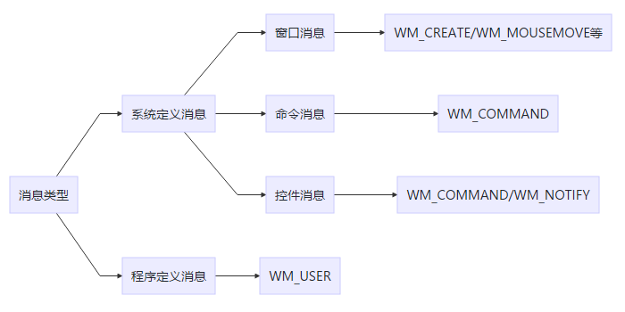

### VC MFC自定义消息步骤
> 何谓消息、消息处理函数、消息映射？   
> 消息简单的说就是指通过输入设备向程序发出指令要执行某个操作。具体的某个操作是你的一系列代码。称为消息处理函数。
##### 按照类型，Windows将消息分为：

<!-- more -->
graph LR
消息类型-->系统定义消息
消息类型-->程序定义消息
系统定义消息-->窗口消息
系统定义消息-->命令消息
系统定义消息-->控件消息
程序定义消息-->WM_USER
窗口消息-->WM_CREATE/WM_MOUSEMOVE等
命令消息-->WM_COMMAND
控件消息-->WM_COMMAND/WM_NOTIFY

##### 1. 头文件加
```
afx_msg LRESULT OnMyMsg(WPARAM wParam,LPARAM lParam);
#define WM_MY_MSG WM_USER+100
```

##### 2. BEGIN_MESSAGE_MAP 和END_MESSAGE_MAP 之中加
```
ON_MESSAGE(WM_MY_MSG,OnMyMsg)
```

##### 3. CPP文件实现
```
LRESULT CMy10Thread_CreateDlg::OnMyMsg(WPARAM wParam, LPARAM lParam)
```

##### 4. 发送消息
```
::PostMessage(AfxGetMainWnd()->m_hWnd,WM_MY_MSG,i,0);
```

##### 5. 强制类型转 wParam 的消息
```
CString str;  
str.Format("%d",wParam);
```

##### 6. POST CString 数据
```
CString s_zkzm;
s_zkzm.Format("123456789123456789");
::PostMessage(AfxGetMainWnd()->m_hWnd,WM_STUZKZ_MSG,0,LPARAM(new CString(s_zkzm)));

//接收
LRESULT CCBKVideoCtrlDlg::OnSTUZKZMsg(WPARAM wParam,LPARAM lParam)
{
	CString *pmsg=(CString *)lParam;
	CString temp=*pmsg;
//	MessageBox(temp);
//	tcpsock.SendString(,MSG_START,temp);
	delete pmsg;
	return 0;
}
```

PostMessage到主窗口
```
::PostMessage(AfxGetMainWnd()->m_hWnd,WM_CLOSE,0,0);
```
