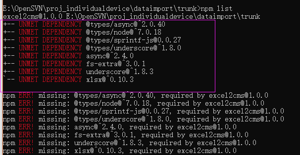
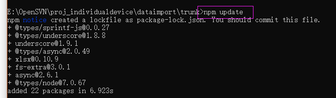

> 淘宝 NPM 镜像 http://npm.taobao.org/
> 因为npm安装插件是从国外服务器下载，受网络影响大，可能出现异常，如果npm的服务器在中国就好了，所以我们乐于分享的淘宝团队干了这事。！来自官网：“这是一个完整 npmjs.org 镜像，你可以用此代替官方版本(只读)，同步频率目前为 10分钟 一次以保证尽量与官方服务同步。”
<!-- more -->

#### 安装淘宝npm（cnpm）
##### 1.安装cnpm ,输入以下命令
```
npm install -g cnpm --registry=https://registry.npm.taobao.org
```
##### 2.输入cnpm -v输入是否正常，这里肯定会出错。
```
cnpm -v
```

#### UNMET DEPENDENCY报错解决

```
npm list
```
   
npm list 里报错UNMET DEPENDENCY，解决更新下就好

```
npm update
```
   

